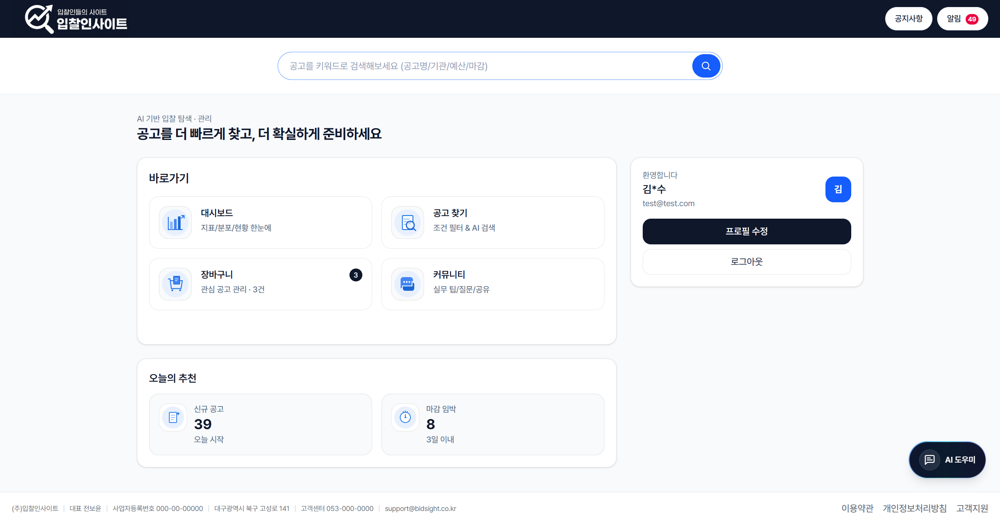
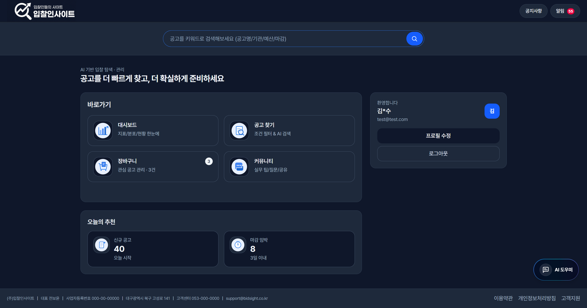
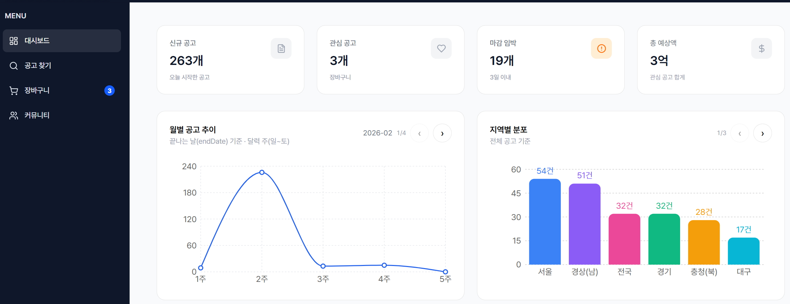
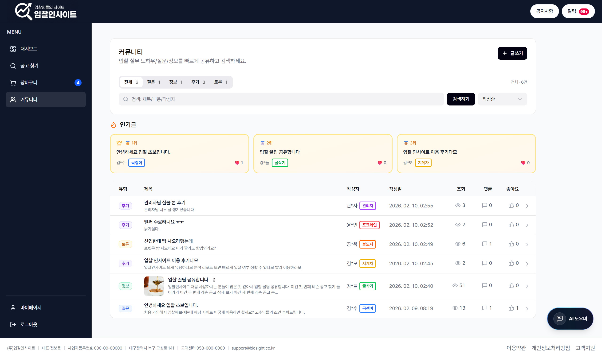
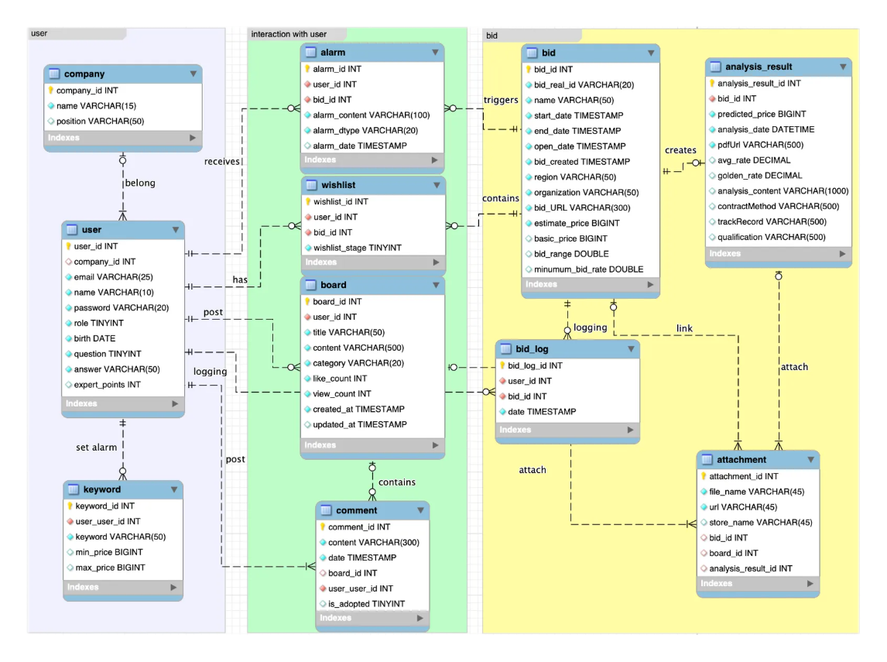
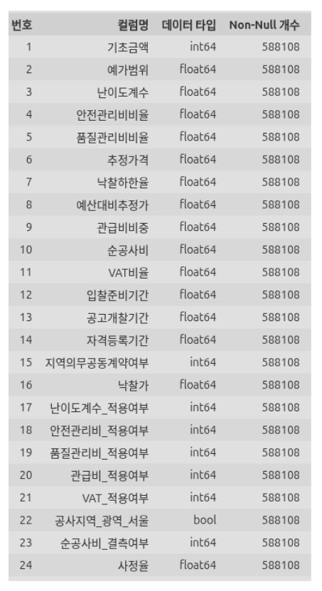

# 🏠 AIVLE 스쿨 빅 프로젝트 16조

## 🏢 AI 기반 입찰 인텔리전스 플랫폼

<!-- 프로젝트 대표 이미지 추가해야함 -->
<div align="center">
  
  
  <!-- 배지들, 최종이후에 올릴예정-->
  [](https://python.org)
  [](https://reactjs.org)
  [](https://fastapi.tiangolo.com)
  
<!-- BidAssitance wiki 페이지 만들어서 링크 수정할 것 -->
**📖 [Documentation Wiki](https://github.com/LxNx-Hn/chatbot-with-kt-dgucenter/wiki/%EC%9C%84%ED%82%A4%E2%80%90%EB%AC%B8%EC%84%9C%EB%AA%A8%EC%9D%8C)**
</div>

---

## 📋 목차

1. [👥 팀 구성](#-팀-구성)
2. [📁 리포지토리 구조](#-리포지토리-구조)
3. [📖 프로젝트 소개](#-프로젝트-소개)
4. [🎯 서비스 핵심 기능](#-서비스-핵심-기능)
5. [🛠️ 기술 스택](#️-기술-스택)
6. [🏗️ 상세 구현 내용](#️-상세-구현-내용)
7. [🚀 배포 상세](#-배포-상세)
8. [👨‍💻 팀원별 상세 업무](#-팀원별-상세-업무)<!-- 9. [📝 회의록 및 개발 과정](#-회의록-및-개발-과정) -->
9. [💬 프로젝트 소감](#-프로젝트-소감)

---

## 👥 팀 구성

<div align="center">
  <table>
    <tr>
      <td align="center" width="200px">
        <br>
        <b>전보윤</b><br>
        <sub>ProjectManager, AI</sub><br>
        <a href="https://github.com/attmc">@attmc</a>
      </td>
      <td align="center" width="200px">
        <br>
        <b>강버들</b><br>
        <sub>FrontEnd</sub><br>
        <a href="https://github.com/bnsneo33-code">@bnsneo33-code</a>
      </td>
      <td align="center" width="200px">
        <br>
        <b>김형모</b><br>
        <sub>BackEnd</sub><br>
        <a href="https://github.com/HyeongmoKim">@HyeongmoKim</a>
      </td>
      <td align="center" width="200px">
        <br>
        <b>공동욱</b><br>
        <sub>BackEnd</sub><br>
        <a href="https://github.com/wish1124">@wish1124</a>
      </td>
    </tr>
  </table>
  <table>
    <tr>
      <td align="center" width="200px">
        <br>
        <b>윤성빈</b><br>
        <sub>AI</sub><br>
        <a href="https://github.com/ysb1208">@ysb1208</a>
      </td>
      <td align="center" width="200px">
        <br>
        <b>이세용</b><br>
        <sub>BackEnd</sub><br>
        <a href="https://github.com/pla2n">@pla2n</a>
      </td>
      <td align="center" width="200px">
        <br>
        <b>장우진</b><br>
        <sub>AI</sub><br>
        <a href="https://github.com/jwj9456">@jwj9456</a>
      </td>
      <td align="center" width="200px">
        <br>
        <b>황도윤</b><br>
        <sub>FrontEnd</sub><br>
        <a href="https://github.com/HDYee">@HDYee</a>
      </td>
    </tr>
  </table>
</div>

---

## 📁 리포지토리 구조

<!-- 프로젝트 최종 병합 후 수정할 것 -->

<details>
<summary><b>📂 상세 폴더 구조 보기</b></summary>

```
chatbot-with-kt-dgucenter/
├── .gitignore                  # Git 무시 파일
├── README.md                   # 프로젝트 설명서
├── docker-compose.yml          # 도커 컴포즈 설정
├── .github/                    # CI /CD 폴더
│   └──  workflows/             # Github 액션 파일
├──     └── deploy.yml          # CI/CD 자동화 문서
├── ops/                        # 문서 및 운영 자료
│   ├── images/                 # README용 이미지
│   ├── docs/                   # 추가 문서
│   └── presentations/          # 발표 자료
└── DSL_CHAT_BOT/               # 챗봇 소스코드
    ├── backend/
    │   ├── Dockerfile          # 백엔드 도커파일
    │   ├── config/
    │   │   ├── __init__.py
    │   │   ├── constants.py    # 카테고리 상수, 모델명
    │   │   └── settings.py     # API 키 불러오기, API URL, DB 경로
    │   ├── data/
    │   │   ├── final_data.csv  # 사업장 데이터
    │   │   └── master_summary_final.csv # 창업률 통계
    │   ├── models/
    │   │   ├── __init__.py
    │   │   ├── embedding_model.py # ko-sroberta 임베딩
    │   │   └── llm_model.py    # Midm-2.0-Mini LLM
    │   ├── services/
    │   │   ├── __init__.py
    │   │   ├── labeling.py     # 질문 카테고리 라벨링
    │   │   ├── policy_service.py # 정책 정보 검색
    │   │   ├── startup_service.py # 창업 데이터 분석
    │   │   └── trend_service.py # 트렌드 분석
    │   ├── utils/
    │   │   ├── __init__.py
    │   │   └── text_processor.py # CSV→텍스트 변환, 동의어/유의어 사전
    │   ├── main.py             # FastAPI 서버
    │   ├── rag_llm.py          # 호환성 레이어
    │   ├── requirements.txt    # Python 의존성
    │   └── .env                # API키 저장 <- 로컬에서 사용시 생성필요
    └── frontend/
        ├── Dockerfile          # 프론트엔드 도커파일
        ├── netlify/                  # Netlify Functions 폴더
        │   └── functions/
        │       └── chat.js           # Functions 핸들러
        ├── public/
        ├── src/
        │   ├── components/
        │   │   ├── ChatBot.jsx       # 메인 챗봇 컴포넌트
        │   │   ├── ChatBubble.jsx    # 채팅 말풍선
        │   │   ├── ChatHeader.jsx    # 챗봇 헤더
        │   │   ├── ChatInput.jsx     # 입력창
        │   │   ├── ChatMessages.jsx  # 메시지 목록
        │   │   └── ThemeToggle.jsx   # 테마 토글
        │   ├── context/
        │   │   └── ThemeContext.jsx  # 테마 컨텍스트
        │   ├── styles/
        │   │   └── ChatStyles.css    # 스타일시트
        │   ├── App.jsx               # 메인 앱
        │   └── index.js              # 엔트리 포인트
        ├── netlify.toml              # Netlify 설정 파일
        ├── .env                      # 백엔드 요청경로 <- 로컬사용시 생성필요
        └── package.json              # Node.js 의존성
```

</details>

---

## 📖 프로젝트 소개

소형·중형 건설사를 위한 **AI 기반 입찰 인텔리전스 플랫폼​**입니다.

### 🎯 프로젝트 목표

AI를 활용한 지능형 검색, 공고 상세 분석을 통해서 누구든지 저비용으로 간편하게 정보를 얻는 입찰 플랫폼 구축​

#### 프로젝트 구동 화면

> **🏠 메인화면**
>
> <div align="center">
>     
>      
> </div>
> <br>

> **💼 대시보드 & 맞춤형 추천**
>
> <div align="center">
>   
>  
> </div>
> <br>

> **📋 지능형 검색**
>
> <div align="center">
>   
> </div>
> <br>

> **📈 AI 요약 보고서**
>
> <div align="center">
>   
> </div>
> <br>

> **📱 커뮤니티**
>
> <div align="center">
>   
> </div>
> <br>

---

## 🎯 서비스 핵심 기능

### 📊 대시보드 & 맞춤형 추천

- **추천 공고 제공** : 사용자 방문 기록 및 관심 공고 기반으로 맞춤 공고 확인
- **핵심 지표 한눈에** : 신규 공고 / 마감 임박 공고 등 주요 현황 빠르게 확인
- **공고별 추이 분석** : 공고별 변화 추이 그래프를 통해 트렌드 파악 가능

### 📝 AI 요약 보고서

- **RAG 기반 요약** : 공고문 내용을 검색(Retrieval) 후 요약(Generation)하여 핵심 정보 전달
- **사정율 구간 예측** : AI 분석을 통해 낙찰 확률이 높은 사정율 구간 제시, 전략적인 투찰 의사결정 지원
- **핵심 정보 추출** : 필요한 조건/요건/제출 서류 등 중요한 내용을 구조화하여 제공
- **결과 분석** : 요약 결과를 기반으로 인사이트 및 체크리스트 형태로 지원

### 🤖 챗봇 (지능형 검색)

- **자연어 검색** : 키워드가 아닌 문장 기반 질문으로 공고 및 사이트 이용 정보 검색 가능
- **첨부 파일 업로드** : 공고문을 첨부해 공고 내용 요약 가능
- **RAG 기반 챗봇** : RAG 기반으로 Router와 Tool을 결합한 챗봇
- **빠른 탐색** : 필요한 공고 정보 및 요약 / 사이트 이용 정보를 대화형으로 빠르게 확인

### 💬 커뮤니티

- **카테고리 기반 소통** : 질문 / 정보 / 후기 / 토론 카테고리로 이용자 간 정보 공유 활성화
- **실무 팁 공유** : 입찰 경험 및 노하우를 커뮤니티에서 쉽게 공유 가능
- **참여 유도** : 사용자 간 상호작용으로 서비스 체류 및 활용도 증가

### 🖥️ 사용자 친화적 인터페이스

- React 기반 웹 애플리케이션
- 입찰 공고를 **업무 파이프라인 기반 상태 관리 UI** 제공
- 실제 입찰 업무 흐름(관심 → 검토 → 참여결정 → 서류 준비 → 제출 완료)을 시각적으로 표현
- 마감, 키워드 알림 기능을 통해 중요한 소식을 놓치지 않고 확인가능
- 마감 공고 자동 분리로 가독성 및 관리 효율 향상
- 다크 / 라이트 테마 지원

---

## 🛠️ 기술 스택

<div align="center">

### 🌐 Frontend


### ⚙️ Backend


### 🤖 AI/ML Framework


### 🧠 AI Models & Systems


### 🗄️ Data Processing


### ☁️ DevOps & Deployment


### 🚀 CI/CD


</div>

---

## 🏗️ 상세 구현 내용

### 📊 서비스 플로우

<div align="center">
  
</div><br>

- 탐색부터 보고서 생성까지 이어지는 서비스 플로우

### 📋 시스템 아키텍처

<div align="center">
  
</div><br>

- Spring Boot의 안정적인 서비스 운용과 FastAPI의 고성능 AI 연산이 결합된  
  **클라우드 네이티브 아키텍처**

### 🖼️ ERD

<div align="center">
  
</div><br>

- AI 기반 입찰 분석 결과를 제공하기 위한 최적화된 데이터 모델링
  - **유저 영역** : 유저의 개인정보, 키워드 알람을 위한 정보를 저장하는 부분
  - **상호작용 영역** : 공고에 대한 편의기능을 유저 맞춤으로 제공하기 위해 존재하는 부분
  - **공고 영역** : 공고, 공고 AI 분석 보고서 등 공고와 관련된 파일을 저장하는 부분

### 📈 AI 모델 플로우

<div align="center">
  
</div><br>

- AI 챗봇을 위해 이어지는 세 종류의 서비스 플로우
  - **질문 분류 후 사이트 질문에 대해 FAISS RAG 모델을 활용해 사이트 이용 방법 답변**
  - **LLM이 공고 내용 질문에 따라 DB 조회를 위한 조건 json을 추출하고 이후 db를 통해 조회 후 공고 내용 질문에 답변**
  - **공고문 보고서 생성 Agent를 활용해 공고문 업로드 시 보고서 요약 내용을 답변**

### 🔢 데이터

### • 공공데이터 OpenAPI 데이터

<div align="center">
  <table>
    <tr>
      <td width="220" align="center">
        
      </td>
      <td align="left">

- 2021.01~2025.12.31 까지 5년간 데이터 588,109건  
  입찰 데이터 확보 (결측치 처리 후 사용)

- **사용한 API**
  - 조달청\_나라장터 공공데이터개방표준서비스
  - 조달청\_나라장터 입찰공고정보서비스
  - 조달청\_나라장터 낙찰정보서비스

- **dataset_feature_selected.csv** : 사용한 3가지의 API를 결합한 데이터
  </td>
    </tr>

    </table>
  </div>

### • 데이터 - 모델 설계 및 고도화(사정율 예측)

<div align="center">
  
</div><br>

- Quantile Regression에서 확률밀도함수(PDF) 구간에 따른 확률 추출  
  ➡️ **Weighted loss 적용 및 KDE를 통해 예측 안정화**

---

# 🚀 배포 상세

<!-- - 📖 **[소스코드 기반- 설치 및 실행 가이드](https://github.com/LxNx-Hn/chatbot-with-kt-dgucenter/wiki/%EC%86%8C%EC%8A%A4%EC%BD%94%EB%93%9C%EA%B8%B0%EB%B0%98-%EB%B0%B0%ED%8F%AC%EA%B0%80%EC%9D%B4%EB%93%9C)** - 시스템 요구사항, Docker 설치, 트러블슈팅 포함

- 📖 **[이미지 기반- 설치 및 실행 가이드](https://github.com/LxNx-Hn/chatbot-with-kt-dgucenter/wiki/%EC%9D%B4%EB%AF%B8%EC%A7%80-%EA%B8%B0%EB%B0%98-%EB%B0%B0%ED%8F%AC-%EA%B0%80%EC%9D%B4%EB%93%9C)** - 컨테이너 실행, 환경변수 주입 , 트러블슈팅 포함 -->

## 🔄 배포 CI/CD 파이프라인

<div align="center">
  
</div><br>

- **자동화** : GitHub에 Push시 빌드부터 배포까지 자동화 구현
- **표준화** : Docker 컨테이너로 표준화하여 배포 일관성 확보
- **클라우드** : Azure Cloud에 컨테이너를 호스팅하여 확장성과 안정성 확보

## 🛠️ 설치 및 실행 가이드 (Installation & Setup)

이 프로젝트는 **Backend (Java Spring Boot), Frontend (React), AI/ML (Python)** 세 가지 주요 컴포넌트로 구성되어 있습니다. 아래 순서대로 설치 및 실행을 진행해주세요.

### 📋 사전 요구사항 (Prerequisites)

프로젝트 실행을 위해 다음 도구들이 설치되어 있어야 합니다.

- **Java JDK 17** 이상
- **Node.js 18.x** 이상 (Front-end)
- **Python 3.10** 이상 (AI/ML)
- **MySQL 8.0** 이상

---

### 1️⃣ 데이터베이스 설정 (Database Setup)

1. MySQL에 <code>aivleTK</code> 데이터베이스를 생성합니다.
2. 프로젝트 내 SQL 스크립트를 실행하여 스키마를 생성합니다.
   - 파일 위치 :
   - (선택사항) 최신 스키마 변경사항이 있다면 마이그레이션 스크립트도 실행합니다.

---

### 2️⃣ AI/ML 모델 서버 설정 (AI/ML Setup)

낙찰가 예측 모델을 학습하거나 API 서버를 실행합니다.

1. 가 있는 루트 디렉토리로 이동합니다.
2. Python 가상환경 생성 및 패키지 설치:
3. 모델 학습 및 실행:

---

### 3️⃣ 백엔드 서버 실행 (Backend Setup)

Spring Boot 서버를 실행하여 API를 제공합니다.

1. **설정 파일 수정** :
2. **서버 실행** :
   - 성실히 빌드 후 [http://localhost:8080](http://localhost:8080)에서 서버가 시작됩니다.

---

### 4️⃣ 프론트엔드 실행 (Frontend Setup)

React 웹 애플리케이션을 실행합니다.

1. **환경 변수 설정** : <code>Bid_FrontEnd/frontend</code> 디렉토리에 <code>.env</code> 파일을 생성합니다.
2. **실행** :
   - 브라우저에서 [http://localhost:5173](http://localhost:5173)으로 접속합니다.

---

### ❓ 트러블슈팅 (Troubleshooting)

- **CORS 오류** : 프론트엔드(5173)와 백엔드(8080) 포트가 다르므로, 백엔드의 <code>WebConfig</code>에서 CORS 설정이 올바른지 확인하세요.
- **DB 연결 실패** : MySQL 서비스가 실행 중인지, <code>application.yaml</code>의 계정 정보가 정확한지 확인하세요.
- **Python 패키지 오류** : <code>pip install --upgrade pip</code> 후 다시 설치해보세요. LightGBM 설치 시 오류가 난다면 <code>libomp</code> (Mac) 등을 설치해야 할 수 있습니다.

```bash
  cd Bid_FrontEnd/frontend # 의존성 설치
  npm install # 개발 서버 실행
  npm run dev
```

```env
  VITE_API_BASE_URL = http://localhost:8080/api
```

```bash
  cd BidAssistance_BE/BE/aivleTK
  # Mac : /Linux./gradlew bootRun
  # Windows : gradlew.bat bootRun
```

```yaml
spring:
datasource:
url: jdbc:mysql://localhost:3306/aivleTK
username: <YOUR_DB_USERNAME>
password: <YOUR_DB_PASSWORD>
```

1. BidAssistance_BE/BE/aivleTK/src/main/resources/application.yaml 파일을 열어 DB 정보와 Azure/OpenAI 키를 설정합니다.

```bash
  # 모델 학습 (약 5-10분 소요)
  python train_bid_rate_model.py

  # (옵션) 예측 API 서버 실행 시
  # python app.py  (만약 별도의 Flask/FastAPI 서버가 있다면)
```

```bash
  # 가상환경 생성 (선택사항)
  python -m venv venvsource venv/bin/activate

  # Mac/Linux
  # venv\Scripts\activate

  # Windows
  # 패키지 설치
  pip install -r requirements_ml.txt
```

1. train_bid_rate_model.py
   - BidAssistance_BE/BE/aivleTK/src/main/resources/nara.sql

```sql
  CREATE DATABASE aivleTK;
```

<!-- ### 📦 배포 환경

<div align="center">
  <table>
    <tr>
      <th>구분</th>
      <th>플랫폼</th>
      <th>용도</th>
      <th>특징</th>
    </tr>
    <tr>
      <td><b>Backend</b></td>
      <td>RunPod</td>
      <td>GPU 지원 LLM 서비스</td>
      <td>자동 스케일링, 비용 최적화</td>
    </tr>
    <tr>
      <td><b>Frontend</b></td>
      <td>Netlify</td>
      <td>React 앱 호스팅</td>
      <td>CDN, 자동 SSL, 무료 티어</td>
    </tr>
    <tr>
      <td><b>Container Images</b></td>
      <td>GitHub Container Registry</td>
      <td>Docker 이미지 저장소</td>
      <td>공개 이미지, 버전 관리</td>
    </tr>
  </table>
</div> -->

<!-- ### 🛠️ CI/CD 워크플로우

**📋 [GitHub Actions 워크플로우 코드](https://github.com/LxNx-Hn/chatbot-with-kt-dgucenter/blob/main/.github/workflows/deploy.yml)** - 전체 빌드/배포 자동화 스크립트

**📖 [CI/CD 가이드문서](https://github.com/LxNx-Hn/chatbot-with-kt-dgucenter/wiki/CI-CD-%EA%B0%80%EC%9D%B4%EB%93%9C%EB%AC%B8%EC%84%9C)** - 워크플로우 설정, 사용방법 ,트러블슈팅 포함

<details>
<summary><b>🔧 워크플로우 주요 단계</b></summary>

1. **코드 체크아웃** - 최신 소스코드 가져오기
2. **Docker 이미지 빌드** - 백엔드/프론트엔드 컨테이너 빌드
3. **GHCR 푸시** - 빌드된 이미지 레지스트리에 업로드
4. **RunPod 배포** - 백엔드 API 자동 배포
5. **Netlify 배포** - 프론트엔드 자동 배포 (병렬 처리)

**🎯 특징:**

- 주석 기반 유연한 배포 설정 (다양한 플랫폼 지원 준비)
- 환경변수 보안 관리 (GitHub Secrets 활용)
- 실패 시 자동 롤백 지원

</details>

### 🔗 배포된 서비스 및 이미지

- **🌐 프론트엔드**: [Netlify 서비스](https://your-app.netlify.app)
- **⚙️ 백엔드 API**: [RunPod 서비스](https://your-api.runpod.io)
- **🐳 Docker 이미지**:
- Backend: [`ghcr.io/lxnx-hn/chatbot-with-kt-dgucenter-backend:latest`](https://github.com/LxNx-Hn/chatbot-with-kt-dgucenter/pkgs/container/chatbot-with-kt-dgucenter-backend)
- Frontend: [`ghcr.io/lxnx-hn/chatbot-with-kt-dgucenter-frontend:latest`](https://github.com/LxNx-Hn/chatbot-with-kt-dgucenter/pkgs/container/chatbot-with-kt-dgucenter-frontend) -->

## 👨‍💻 팀원별 상세 업무

<!-- 초기 양식, 사용하려면 주석 해제 -->
<!-- <details>
<summary><b>🏗️ 강버들 - FrontEnd</b></summary>

### 담당 업무

- **프로젝트 전체 설계 및 아키텍처 구성**
- **백엔드 개발 지원 및 FastAPI 서버 구축**
- **프론트엔드 UI 구성 및 React 컴포넌트 개발**
- **배포 환경 구축 및 산출물 관리**
- **회의록 정리 및 진행상황 기록 관리**
- **팀원 기술 지원**
- **각종 프로젝트 문서 작성 및 관리**

### 주요 성과

- **RAG 시스템 도입**: 임베딩 모델 기반 검색 증강 생성 구조 설계 및 구현
- **전체 아키텍처 구축**: 프론트엔드-백엔드 연결 및 시스템 전반 설계
- **CI/CD 파이프라인 구축**: GitHub Actions를 통한 자동화된 배포 시스템 구현
- **컨테이너화 및 배포**: Docker 환경 구성과 Netlify, Runpod 배포 인프라 구축
- **프로젝트 관리**: 체계적인 일정 관리와 성과 기록을 통한 효율적 개발 진행

### 사용 기술

**Project Management**

- `Notion`, `Git` , `Github Project` , `GithubWiki`

**Backend & AI**

- `Python`, `FastAPI`, `PyTorch`
- `Transformers`, `Sentence-Transformers`
- `RAG (Retrieval-Augmented Generation)`

**Frontend**

- `React`, `JavaScript`, `CSS3`

**DevOps**

- `Docker`, `Docker Compose`, `YML`
- `GitHub Actions`, `Netlify`, `Runpod`

**Version Control**

- `Git`, `GitHub`

</details> -->
<details>
<summary><b>🎯 전보윤 - ProjectManager, AI</b></summary>

### 담당 업무

- **Quantile Regression 모델로부터 확률이 높은 상위 3위 사정율 구간 추출**
- **AI 요약 보고서, Chatbot 파이프라인 설계**
- **모델 EndPoint 생성 후 FastAPI 서빙**

</details>

<details>
<summary><b>🏗️ 강버들 - FrontEnd</b></summary>

### 담당 업무

- **UI/UX 설계**
- **AI 초기 모델 설계 및 비교**

</details>

<details>
<summary><b>🗄️ 공동욱 - BackEnd</b></summary>

### 담당 업무

- **Spring 입찰영역 MVC/CRUD 설계**
- **Azure Container 설계 배포 관리**
- **DB 스키마 설계,FastAPI 서버 파이프라인설계 및 CI/CD 관리**

</details>

<details>
<summary><b>⚡ 김형모 - BackEnd</b></summary>

### 담당 업무

- **Spring 공고영역 MVC/CRUD 설계**
- **Github Action CI/CD 관리**
- **Azure Container 및 보안 설계 관리**

</details>

<details>
<summary><b>🔗 윤성빈 - AI</b></summary>

### 담당 업무

- **나라장터 데이터 분석 및 전처리**
- **Chatbot EndPoint 세부 구현**
- **Chatbot 공고 조회 기능 설계**
- **Chatbot Toolnode 기능 개선**
- **웹사이트 QA**

</details>

<details>
<summary><b>🏛️ 이세용 - BackEnd</b></summary>

### 담당 업무

- **Spring MVC/CRUD 설계**
- **Github Action CI/CD 관리**
- **Frontend 설계 및 BackEnd와의 연동**
- **DB 스키마 설계**

</details>

<details>
<summary><b>🚧 장우진 - AI</b></summary>

### 담당 업무

- **사이트 이용 안내 Toolnode 설계 및 구현**
- **FAISS 기반 Vector DB 구축**
- **멀티모달 데이터(이미지, Excel) 임베딩**

</details>

<details>
<summary><b>🏢 황도윤 - FrontEnd</b></summary>

### 담당 업무

- **프론트엔드 - 백엔드 API 연동 및 데이터 흐름 관리**
- **React 기반 입찰 관리 서비스 기획 및 개발**

</details>

<!-- 아래 내용은 사용할 시 주석 해제할 것 -->
<!-- ---

## 📝 회의록 및 개발 과정

**[📊 GitHub 프로젝트 보드](https://github.com/users/LxNx-Hn/projects/3)** - 실시간 개발 현황, 회의록, 이슈 트래킹

--- -->

## 💬 프로젝트 소감

### 🎯 전보윤 - ProjectManager, AI

> "사용자 입장에서 결과값을 받았을 때 어떻게 하면 신뢰할 수 있는지 고민해볼 수 있었던 프로젝트였습니다. 
> 그 결과 조건부 분위수 함수로부터 확률 추출이라는 문제를 직면했고,  부족했던 부분을 공부해볼 수 있어서 좋았습니다. 
> 다만, 데이터를 깊게 이해하고 더 좋은 품질의 데이터로 가공을 진행하기 어려웠던 점이 아쉬웠습니다."

### 🏗️ 강버들 - FrontEnd

> "프론트엔드를 맡아 화면 요구사항을 백엔드·디자인·기획과 계속 싱크 맞추면서, 작은 문구/정렬부터 로그인 상태 같은 흐름까지 사용자 경험을 끝까지 다듬는 게 쉽지 않다고 체감했습니다.
> 특히 API 정의서가 명확해야 개발·디버깅·책임 범위가 깔끔해진다는 걸 느꼈고, 스펙을 기준으로 이슈를 빠르게 정리·전달하는 방식이 프로젝트 속도를 좌우한다는 생각이 들었습니다."

### 🗄️ 공동욱 - BackEnd

> "우선 프로젝트를 진행하며 여러 다른사람들과 소통과 조율의 중요성에 대해 크게 느낄수 있었습니다. 
> 모델 결과를 서비스 하는 과정에 있어서 학습과, 데이터구조, API 설계, 배포까지 하나의 서비스를 전부 경험해 볼수 있어서 좋았습니다.
> 다만 고도화에 있어서 보안과 좀더 빠르고 효율적인 관리를 위한 오케스트레이션이나 다른 모델들을 사용을 못해본게 아쉬웠습니다."

### ⚡ 김형모 - BackEnd

> "이 프로젝트를 하면서 평소 관심이 있었던 클라우드를 깊게 실습해볼 수 있어서 좋았습니다.
> 비용적으로 그리고 성능적으로 가장 효율적인 서비스를 선택할 수 있도록 팀원들과 고민하며 여러 방식을 시도했던게 기억에 남습니다. 도메인도 구매해서 사용해 볼 수 있어서 좋았으나 컨테이너 간의 연결속도를 개선하지 못해서 아쉬웠습니다."

### 🔗 윤성빈 - AI

> "도메인 이해가 부족하더라도 데이터 분석을 통해 초기 상황 진단과 패턴 탐색에는 효과적이지만, 결국 정확한 해석과 의사결정을 위해 결국에는 도메인 지식이 필요하다는 것을 크게 느꼈습니다. 챗봇 구현을 하며 환각을 막기 위해 프롬프트로 제한하는 것과 UX를 좋게 하기 위해 어느 정도 추론을 허용하는 것 이 사이의 균형을 맞추는게 어려웠습니다. 이번 경험을 바탕으로 UX를 유지하면서 환각을 줄이려면 어떻게 프롬프트를 구성해야하는지에 대해 깊은 고찰을 할 수 있었습니다."

### 🏛️ 이세용 - BackEnd

> "이번 빅프로젝트를 통해 많은 사람들과 기획부터 개발, 배포, 그리고 최종 발표까지 End-to-End 프로세스를 경험할 수 있었습니다. 특히, RAG 기반 AI 모델과 CI/CD 파이프라인 구축 등 현업과 유사한 기술 스택을 팀원과 함께 고민하고 적용해보며 개발자로서의 시야를 넓힐 수 있었습니다. 해당 프로젝트를 진행하면서 에이블스쿨에서 배웠던 기술들을 적절히 실습해볼 수 있어 그 과정에서 한층 더 성장하게 되었고, 이후에 비슷한 프로젝트를 진행할 때 주도적으로 이끌어 갈 수 있다는 확신을 얻었습니다."

### 🚧 장우진 - AI

> "처음에는 막막함과 걱정이 많았으나, 프로젝트를 진행하며 기술적인 역량뿐 아니라 협업의 중요성에 대해서도 많은 것을 배울 수 있었습니다.
> 사이트 이용 안내 기능을 구현하는 과정에서 구조화의 중요성을 체감하였고, 다양한 형태의 데이터를 다루며 정보 정리와 활용 방식에 대한 이해가 한층 넓어졌습니다.
> 다만 개인적으로 성능 향상을 위한 다양한 방안을 충분히 고민하고 반영하지 못한 점이 아쉬웠습니다."

### 🏢 황도윤 - FrontEnd

> "프로젝트를 직접 기획해보면서 기업 입장에서 어떤 서비스를 매력적으로 느낄지 비즈니스적인 관점에서 생각해볼 수 있었습니다.
> 그리고 프로젝트 진행할 때 도메인 지식도 참 중요하다는 걸 느꼈습니다.
> 실제 프로젝트를 기획부터 개발까지 진행해보면서 단순히 화면을 만드는 것이 아니라,
> 사용자가 어떤 흐름으로 서비스를 이용할지를 고민하는 경험을 해볼 수 있어서 좋았습니다."

---

<div align="center">
  <sub>Built with ❤️ AIVLE 스쿨 빅 프로젝트 16조</sub>
</div>
